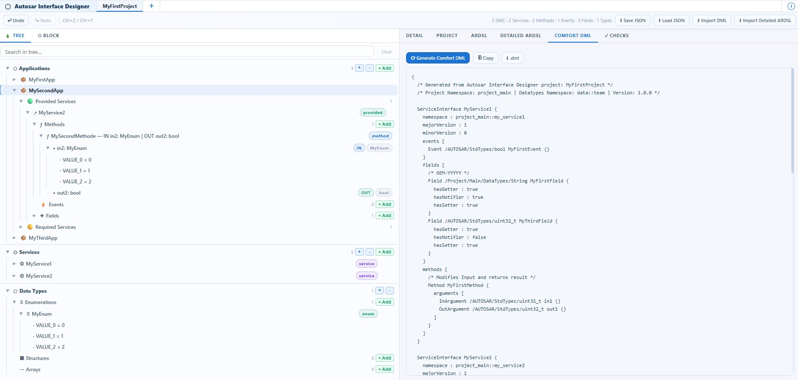
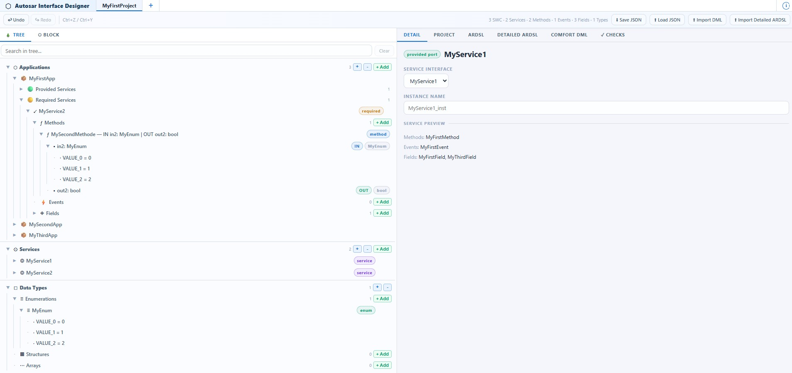
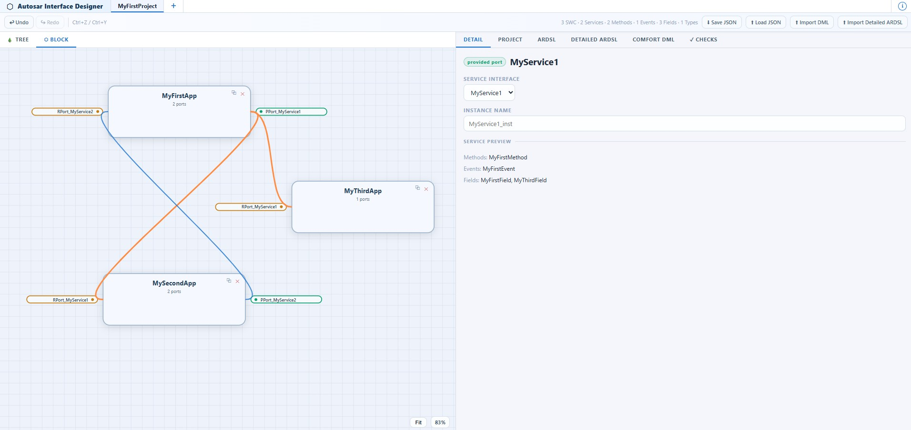

# Autosar Interface Designer

**Version:** v0.1.2

A modern, interactive web-based tool for designing and editing Adaptive Software Component (in arDSL and DML) architectures. Visually model adaptive applications, services, ports, methods, events, and data types with real-time validation and automatic code generation.



## Features

### Tree View
- **Complete Project Structure**: Organized hierarchical view of all applications, services, and data types
- **Expand/Collapse Controls**: Manage tree expansion with global expand/collapse buttons
- **Search & Filter**: Search across the entire tree by name
- **Quick Add Actions**: `+ Add` buttons automatically open/close nodes and create new elements
- **Duplicate & Delete**: Context actions for all entities

### Block View Canvas
- **Visual Architecture Design**: Drag-and-drop interface to arrange adaptive applications (SWCs) on an infinite canvas
- **Smart Zoom & Pan**: 
  - Scroll wheel to zoom (35% - 250%)
  - Click and drag on empty canvas to pan
  - "Fit" button to auto-center and auto-zoom all components
  - Live zoom percentage display
- **Interactive Port Editing**: Click any port or service chip directly in the Block View to open details for editing
- **Connection Management**: Automatic and manual service connections between applications with visual Bézier curves
- **Service Highlighting**: Active service is highlighted across all connected ports for clear visual reference

### Detail View
- **Service Editor**: Edit methods, events, and fields with full type system support
- **Port Configuration**: Manage required and provided service ports per application
- **Custom Type System**: Define enums, structs, and arrays with full validation
- **Argument Lists**: Edit method input/output arguments with custom types
- **Real-time Validation**: All changes are immediately validated against the data model

### Code Generation
- **arDSL Generation**: Generate standardized adaptive software component domain language
- **Detailed ARDSL**: Full arDSL with extended documentation
- **Comfort DML**: Generate DaVinci-style Comfort DML from the designed graph
- **DML Import**: Rebuild the graph from supported Comfort DML files produced by the tool
- **Export to File**: Download generated code as `.ardsl` files
- **Copy to Clipboard**: Quick copy of generated output

### Quality Checks
- **20+ Automated Checks**: Comprehensive validation including:
  - Unique naming across scopes
  - Service reference integrity
  - Type system validation
  - Application port consistency
  - Connection endpoint validation
- **Check Catalog**: Browse all available checks before running
- **Issue Severity Levels**: Error, Warning, and Info level findings
- **Auto-Detection**: Continuous model integrity monitoring

### Project Management
- **Save/Load JSON**: Persist projects as JSON for version control
- **Import from DML**: Load supported `.dml` files and reconstruct services, types, applications, and mappings
- **Project Metadata**: Namespace, version, and description tracking
- **Multi-Tab Support**: Work on multiple projects simultaneously
- **Undo/Redo**: Full edit history with Ctrl+Z / Ctrl+Y

## Getting Started

### Open the Tool
Simply open `autosar_interface_designer.html` in a modern web browser (Chrome, Firefox, Edge, Safari).

### Basic Workflow

1. **Create Applications**
   - In Tree View → Applications → `+ Add SWC`
   - Drag to arrange in Block View

2. **Define Services**
   - In Tree View → Services → `+ Add Service`
   - Add methods, events, and fields

3. **Add Ports to Applications**
   - Select application in Block View
   - Click port chip `+ Add Provided Port` or `+ Add Required Port`
   - Select a service interface

4. **Create Connections**
   - Automatic: connections between matching provided/required ports are auto-created
   - Visual: see Bézier curves in Block View
   - Delete: click any line to remove a connection

5. **Validate & Generate**
   - Run Checks tab to validate the architecture
   - Generate arDSL in ARDSL tabs
   - Save as JSON, export as `.ardsl`, or generate/import Comfort DML

## Example Project

Use the included sample project to quickly explore the full workflow:

- Project file: [MyFirstProject.json](MyFirstProject.json)

You can load [MyFirstProject.json](MyFirstProject.json) by the 'Load JSON' button.

### Tree View Example



### Block View Example



## Keyboard Shortcuts

| Action | Shortcut |
|--------|----------|
| Undo | Ctrl+Z |
| Redo | Ctrl+Y |
| Pan Canvas | Click + Drag on empty space |
| Zoom | Scroll wheel |

## Data Model

### Core Entities

- **Adaptive Application (SWC)**: Container for service ports and interfaces
- **Service**: Interface definition with methods, events, and fields
- **Port**: Connection point between applications and services (provided/required)
- **Method**: Synchronous call with input/output arguments (optional fire-and-forget)
- **Event**: Asynchronous notification with typed payload
- **Field**: Property with getter, setter, and notifier accessors
- **Custom Type**: Enum, Struct, or Array definition

### Type System

Built-in AUTOSAR base types:
- Integer types: `int8_t`, `int16_t`, `int32_t`, `int64_t`, `uint8_t`, `uint16_t`, `uint32_t`, `uint64_t`
- Floating point: `float32_t`, `float64_t`
- Strings: `string`, `wstring`
- Boolean: `boolean`
- Byte array: `byte_array`
- Complex: Custom enums, structs, and arrays

## File Format

### JSON Export
Projects are saved as JSON with complete structure preservation:
```json
{
  "meta": { "name": "...", "namespace": "...", "version": "..." },
  "services": [ ... ],
  "customTypes": [ ... ],
  "swcs": [ ... ],
  "connections": [ ... ]
}
```

### DML Export / Import
The Comfort DML tab generates a supported subset of DaVinci-style DML. The importer can reconstruct:
- Service interfaces with methods, events, and fields
- Custom types such as enums, structs, arrays, maps, and variants
- Adaptive applications with provided/required ports
- Service instance mappings
- Notifier field bindings when the generated DML contains the notifier event hint

## Browser Compatibility

- **Chrome/Edge**: Full support (recommended)
- **Firefox**: Full support
- **Safari**: Full support
- **IE11**: Not supported

## Performance Notes

- Optimized for projects with 10–100+ applications
- Real-time zoom and pan on canvas with 1000+ nodes
- Efficient connection line rendering with SVG
- Auto-fit calculation works well with architectures up to 200+ applications

## Tips & Tricks

1. **Quick Selection**: Click service names in port chips to jump directly to service details
2. **Batch Operations**: Use Tree View expand/collapse buttons to manage large trees
3. **Model Validation**: Run Checks tab before export to catch issues early
4. **JSON Backup**: Save JSON regularly; it's your project source of truth
5. **Search**: Use Tree View search to quickly navigate large models

## Limitations

- Auto-connections ignore self-loops (service cannot provide and require itself in same application)
- Ports cannot have duplicate service references per application
- Type names must be globally unique
- Maximum reasonable zoom range: 35% – 250%
- DML import supports the generated Comfort DML subset, not arbitrary vendor DML

## Future Enhancements

- Multi-port per service per application (1..* relationships)
- Custom serialization formats
- Model comparison / diff view
- Template libraries for common patterns
- Collaborative editing (real-time sync)

## Support & Feedback

For issues, feature requests, or feedback, please refer to the project repository or documentation.

## Contact for Help

- **Owner:** Alexander Wegner
- **Email:** alexander.wegner@outlook.com

---

**Autosar Interface Designer** — Build adaptive software architectures with clarity and precision.
